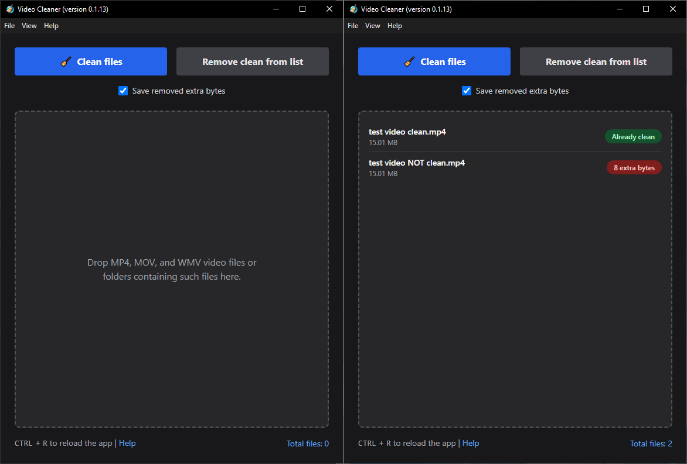

# Video Cleaner GUI

Read everything in this README before using the app.

Welcome to the project page for the **Video Cleaner GUI**. This is a simple app built with Electron which allows users to remove extraneous bytes from the end of MP4, MOV, and WMV video files. It is meant for users who want to ensure the integrity of their video files by detecting and removing random junk or steganographic data.

## Features

The app features:

- easy user interface (see [screenshot](#screenshot))
- drag-and-drop functionality supporting multiple files and folders
- easily remove files that are already clean from your list
- clean all files in the list with a single click
- hover over the "extra bytes" status to see what the extra bytes are
- optionally save the extra bytes you remove to a text file (on by default)

## Installation

Only builds for Windows are available. You will find them on the [Releases page](releases).

You have three options:

1. Unzip the unpacked application, place the files wherever you like, and run from there.
2. Use the portabl app if you want. It's just an EXE file. It will take a little time to load since it's a portable app. ~70 MB
3. Run the one-click installer if you want the app to open faster. It takes up about ~258 MB on disk.

## Usage

1. Open the app.
2. Drag-and-drop entire multiple files or entire folders into it. Files that do not have a .mp4, .mov, or .wmv extension will not be added to the list. If you prefer, use the *File > Open* menu or `Ctrl` + `O` shortcut to open files (but this does not support selecting folders).
3. Click the "remove clean from list" button if you want to remove all the already-clean files from the list. This is not strictly necessary but it helps if you have a ton of files and only some of them have extra bytes.
4. Uncheck the "save removed extra bytes" checkbox IF you don't want to save the extra bytes to a text file.
5. Click "clean files." The app will now remove extra bytes from your video files. Any files in the list that are already clean will be skipped.
6. To clear the list or start again, you can use *File > Clear File List* from the menu, `Ctrl` + `R`, or the "remove clean from list" button.

## Technical Explanation

The cleaner script operates by analyzing the structure of video files at the byte level. It first identifies the file type by examining the file's header, then proceeds to parse the file's chunk structure. For MP4 and MOV files, it reads the atom (chunk) headers, which include a 4-byte size field and a 4-byte type field. For WMV files, it parses the ASF objects, which have a 16-byte GUID as the type identifier and an 8-byte size field.

The script traverses these chunks sequentially, validating each chunk's size and type. If it encounters a chunk smaller than the minimum allowed size for that file type, or if there are remaining bytes after the last valid chunk, it flags these as potential extra bytes. To avoid false positives, the script implements a threshold (MAX_EXTRA_BYTES) to distinguish between genuinely appended data and potential file corruption. When extra bytes are detected and confirmed, the script can either report their presence or remove them, with an option to back up the removed data for safety.

## License

This project is in the public domain. Read the [license](./LICENSE).

## Disclaimer

This app, including its binaries available in the release pages, is provided as-is with no guarantee or warranty. Ther user assumes all risk. Read the [license](./LICENSE).

## Screenshot

